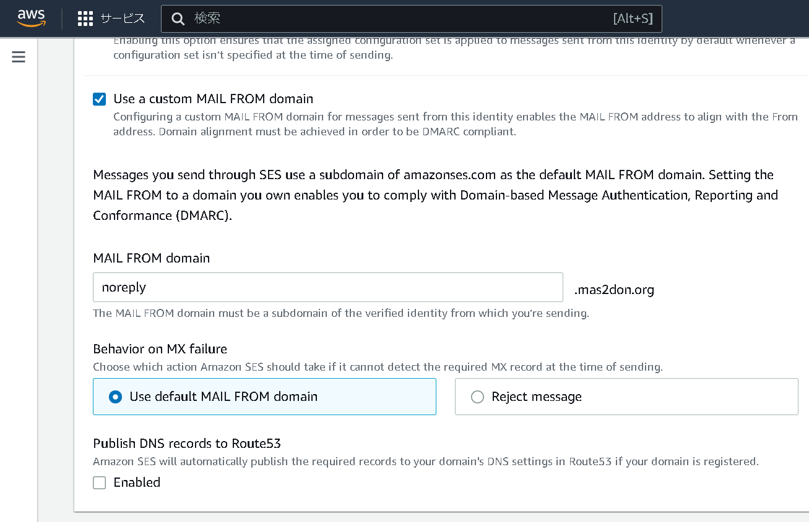
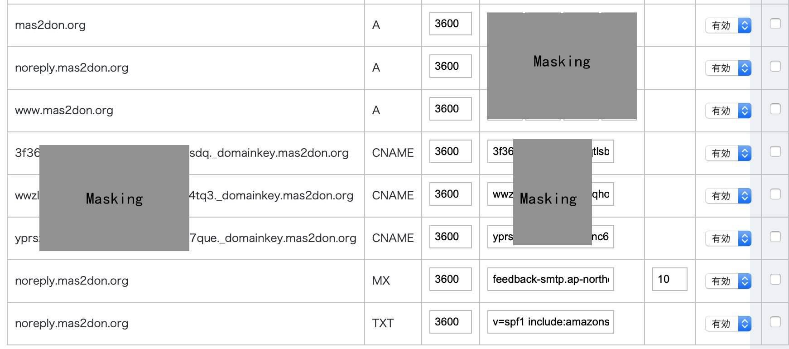

+++
author = "DUAN DAHAI"
title = "Use custom domain to send emails by AWS SES"
date = "2022-12-05"
description = "Use custom domain to send emails by AWS SES"
tags = [
    "AWS",
    "SES"
]
categories = [
    "solutions"
]
+++

In most applications, you may need SMTP service for send some system notifications,
you need not hosting your own SMTP server, because it is much more difficult to do reliably than to use a third-party provider.

In this article, I will show how I use the [AWS SES](https://aws.amazon.com/ses/) on my own domain.

### Get a domain

You can get one from [onamae](https://www.onamae.com/), also you can get one from [godaddy](https://www.godaddy.com/). But I think if you manage your applications on AWS, you should consider the [AWS Route 53](https://aws.amazon.com/jp/route53/).

### Create SES Identity

- At identity details，set your domain  

- Set one send from email address    

- Set identity type like this  

- Add the created CNAME records into you DNS records  

- Add the created MX and TXT record into you DNS records  

- Your DNS records should like this (oname domain DNS example)  

#### Release send restriction
When your identity was successfully verified, you can apply the release to AWS support [by this manual](https://docs.aws.amazon.com/ses/latest/dg/manage-sending-quotas-request-increase.html).

#### Other
Identity verify would take max 72 hours every time when your setting goes failured, so be careful on your DNS records setting.