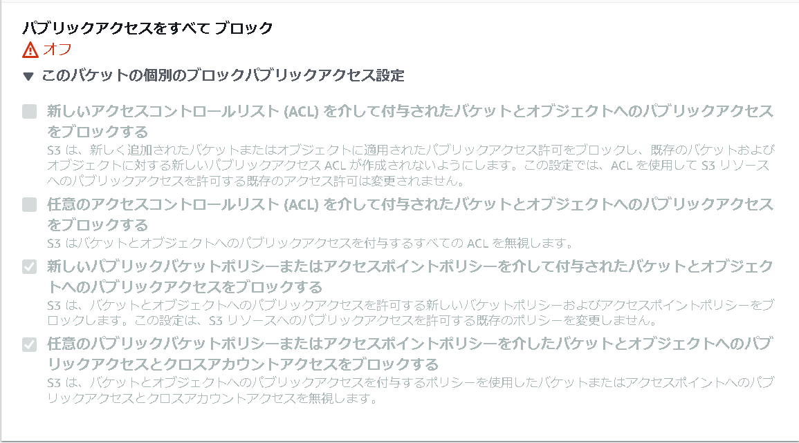

+++
author = "DUAN DAHAI"
title = "使用AWS的S3服务来保存Mastodon的媒体文件"
date = "2022-12-05"
description = "使用AWS的S3服务来保存Mastodon的媒体文件"
tags = [
    "AWS",
    "S3"
]
categories = [
    "Mastodon"
]
+++

#### 概要

本文为[基于云服务的Mastodon站点搭建](https://duandahai.com/zh-cn/posts/zh/20221125-mastodon-site-create.zh-cn/)的关于使用AWS的S3来保存媒体文件的扩展介绍。

#### IAM User

- 创建User，并为User增加你存放文件bucket的访问权限如下。

```json
{
    "Version": "2012-10-17",
    "Statement": [
        {
            "Sid": "VisualEditor1",
            "Effect": "Allow",
            "Action": "s3:*",
            "Resource": "arn:aws:s3:::这里放你的文件的bucket名/*"
        }
    ]
}
```
- 生成该User的access Key

#### S3的访问权限设置
设置bucket的访问权限为允许ACL访问，否则会出现访问被拒的Error。
下图设置后的样子。  


#### Mastodon配置文件更新（.env.production）
如果你是按照官方教程配置的话，你的.env.production在/home/mastodon/live下面放着。  
更新.env.production里面关于文件存储的以下设置。

| 参数名 | 设定值 |
| ------ | ------ |
| S3_ENABLED | true |
| S3_PROTOCOL | https |
| S3_BUCKET | 你存放文件的bucket名，例：files.mas2don.org |
| S3_REGION | 你存放文件bucket的REGION，例：ap-northeast-1 |
| S3_HOSTNAME | 你存放文件bucket的所属Host，例：s3-ap-northeast-1.amazonaws.com |
| AWS_ACCESS_KEY_ID | 你为访问S3创建的User的access key id |
| AWS_SECRET_ACCESS_KEY | 你为访问S3创建的User的access key secret |
| S3_ALIAS_HOST | 可以不用设置，如需配置可参考官方关于[s3_alias_host](https://docs.joinmastodon.org/admin/config/#s3_alias_host)的介绍 |
