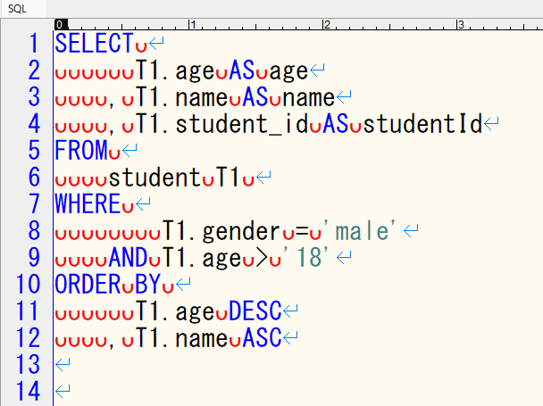
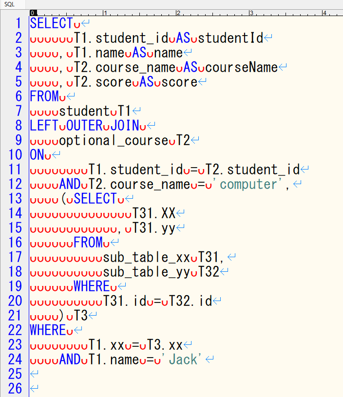

+++
author = "DUAN DAHAI"
title = "基础SQL格式编写规范"
date = "2023-08-31"
description = "基础SQL格式编写规范"
tags = [
    "python",
    "pivot",
]
categories = [
    "解决方案"
]
+++

#### 背景   
经常遇到有人写出的乱糟糟复杂长SQL，令人非常难读，容易出问题不说，出错了还不好调查原因，更别提对于性能上的理解了。   
最近稍微给公司的新人和老人分享了一下SQL格式编写规范，就把内容也共有给大家吧。   

#### 普通单表查询SQL格式   

+ SQL关键字大写，表名、列名根据项目要求可大写可小写
+ 无论使用一张表还是多张表，都给表定义别名，表别名规则为T开头，数字顺序排号
+ 检索列名按照表别名顺序记述，同一表内列名可按照列定义顺序、也可按照列名字母顺序记述。
+ 检索列名尽量也定义别名
+ 关于换行
  + SQL关键字后跟换行
  + 每个检索表后跟换行
  + 每个检索项目后跟换行
  + 每个检索条件后跟换行
  + 每个排序、集计项目于后跟换行
+ 关于空格
  + SQL关键字顶格写，SQL关键字后跟一个空格
  + 每个检索表前跟4个空格，表明与别名之间1个空格
  + 每个检索列名前4个空格，多个检索列名时，逗号放检索列名前，与检索列名间跟1个空格
  + 检索列名的别名关键字前后各1个空格
  + 检索列名开头对齐，可调整第一行检索列名前的空格数，一般为6个空格
  + 每个检索条件前跟4个空格
  + 检索条件运算符前后各跟一个空格
  + 检索条件开头对齐，可调整第一行检索条件前的空格数，一般为8个空格
  + 每个排序、集计列名于前跟4个空格，多个列名时，逗号放列名前，与列名间跟1个空格
  + 排序种别关键字前跟1个空格
  + 排序、集计列名开头对齐，可调整第一行检索项目前的空格数，一般为6个空格

#### 内部结合查询SQL   

+ 表内接统一使用WHERE，放弃使用INNER JOIN
+ 多个表内接时，表的顺序和别名内数字顺序一致
+ 列名与列名的检索条件记述在前，单纯值检索条件记述在后

#### 外部结合查询SQL   

+ 表外接统一使用LEFT OUTER JOIN，放弃使用LEFT JOIN，RIGHT JOIN，RIGHT OUTER JOIN

#### 子表查询SQL   

+ 子表内的表别名需要引用子表的别名，例如子表别名T3，子表内别名为T31，T32

#### 最后
+ 本文中的SQL格式编写规范全部出自个人总结，有不足的地方欢迎指出，有意见不同的地方也欢迎交流。
